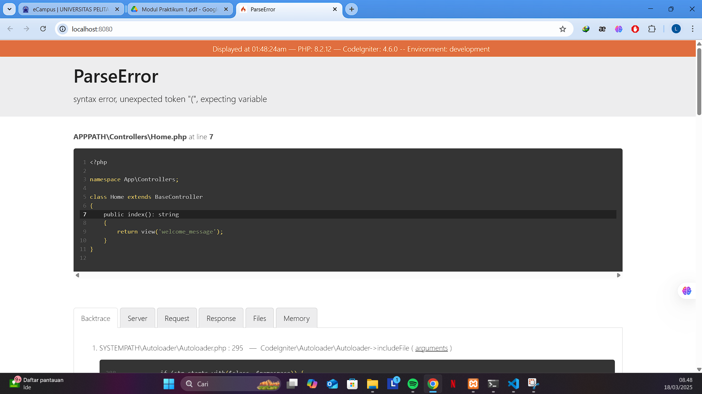
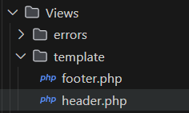
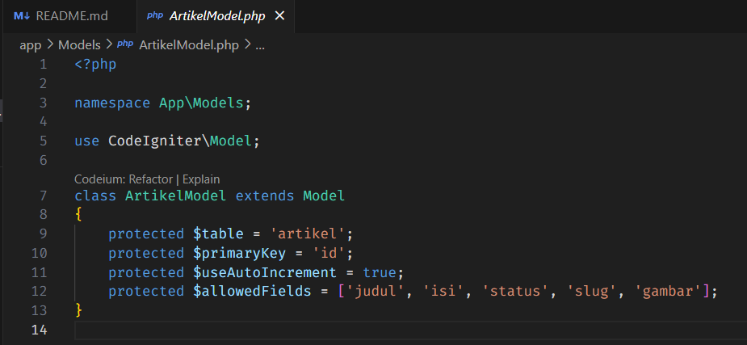
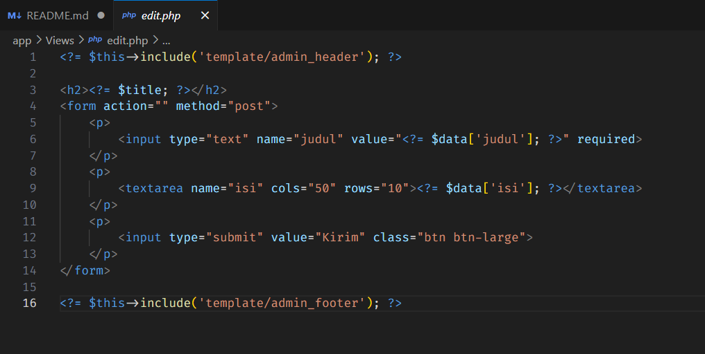
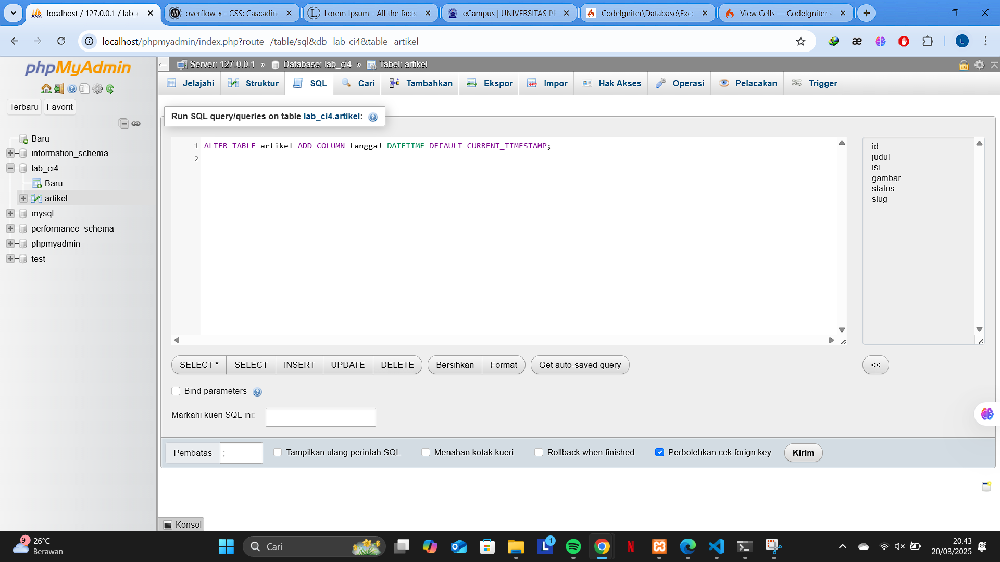
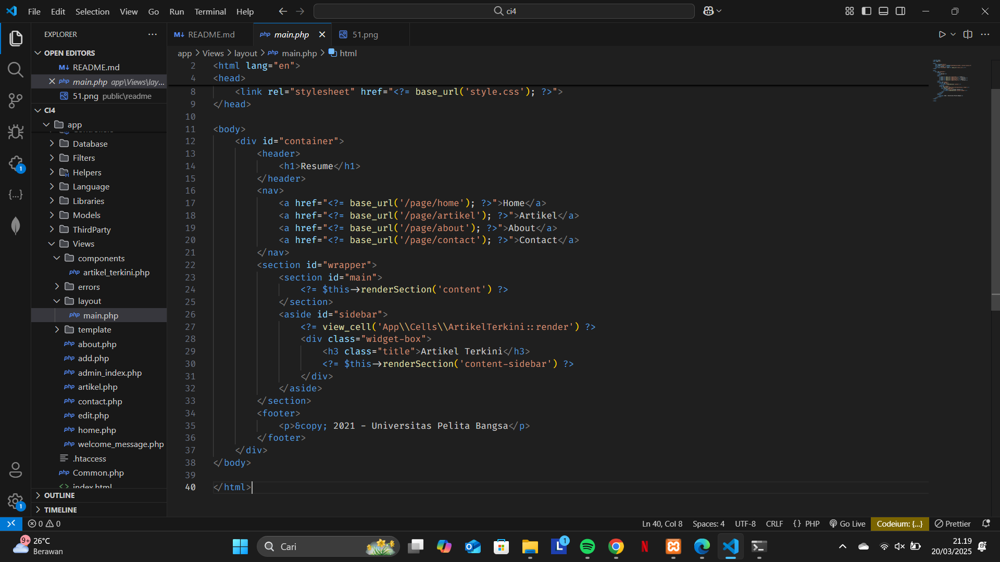
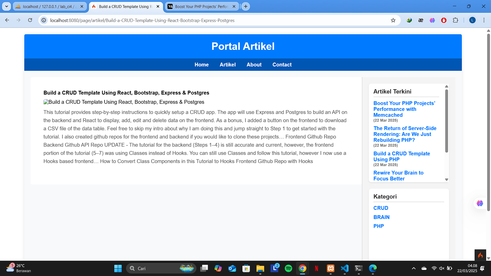

# Praktikum 1

### 1. Mengaktifkan Ekstensi di `php.ini`

Berikut adalah ekstensi PHP yang harus diaktifkan:

1. **php-json** → Diperlukan untuk bekerja dengan JSON.
2. **php-mysqlnd** → Native driver untuk MySQL.
3. **php-xml** → Diperlukan untuk bekerja dengan XML.
4. **php-intl** → Diperlukan untuk mendukung aplikasi multibahasa.
5. **libcurl** (opsional) → Diperlukan jika ingin menggunakan Curl.

Buka xampp file Config `php.ini` dan pastikan ekstensi berikut tidak dikomentari (hilangkan tanda `;` di depannya jika ada):

```ini
extension=json
extension=mysqli
extension=xml
extension=intl
extension=curl
```


### 2. Restart Webserver

Setelah mengaktifkan ekstensi, restart webserver agar perubahan diterapkan.

## Instalasi

### 3. Instalasi CodeIgniter 4

Instalasi dengan cara manual:

1. Unduh **CodeIgniter** → (https://codeigniter.com/download)
2. Extrak file zip Codeigniter ke direktori **htdocs/Lab7Web**
3. Ubah nama direktory **framework-4.x.xx** menjadi **ci4**.

### 4. Menjalankan CLI XAMPP

1. Arahkan direktori sesuai dengan project → (xampp/htdocs/Lab7Web/ci4/)
2. Perintah yang dapat dijalankan untuk memanggil CLI Codeigniter adalah:
   `php spark serve` Meluncurkan server pengembangan bawaan, Memungkinkan melihat aplikasi di browser (http://localhost:8080).


### 5. Mengaktifkan Mode Debugging

Fitur debugging dari CodeIgniter 4 untuk memudahkan developer untuk mengetahui
pesan error apabila terjadi kesalahan dalam membuat kode program. Mengaktifkan mode debugging dengan mengubah niai konfigurasi pada file `env`, cari variable `CI_ENVIRONMENT` ubah menjadi `development`


Kemudian rename nama file `env → .env`

Contoh Error yang terjadi ketika menghapus `function` pada file **app/Controller/Home.php**




### 6. Routing dan Controllers

Routing dalam CodeIgniter 4 adalah proses yang menghubungkan permintaan (request) dari pengguna ke Controller yang sesuai untuk diproses. Routing ini memungkinkan kita menentukan bagaimana URL diterjemahkan menjadi aksi dalam aplikasi, sehingga setiap permintaan dapat diarahkan dengan benar.

**Membuat Route baru (autoRoute(false)):**

Secara default fitur autoRoute sudah aktif. Untuk mengubah status autoroute
dapat mengubah nilai variabelnya. Untuk menonaktifkan ubah nilai true menjadi false. Nonaktifkan Auto Routing `($routes->setAutoRoute(false);)` ketika menjalankan di production.

tambahkan kode berikut dalam **app/Config/Routes.php**


Untuk mengetahui route yang ditambahkan sudah benar, buka CLI dan jalankan perintah `php spark routes`:


**Membuat Controllers:**

tambahkan code berikut dalam **app/Controllers/Page.php & Home.page**


**Summary:**

1. Auto Routing cocok untuk pengembangan cepat, tetapi kurang aman dan sulit dikontrol. Semua method dalam controller bisa diakses langsung dari URL, yang bisa membuka celah keamanan.

2. Manual Routing lebih aman, fleksibel, dan efisien karena hanya route yang didefinisikan secara eksplisit yang bisa diakses. Ini juga memudahkan pengelolaan middleware, otorisasi, dan optimasi aplikasi.

### 6. Membuat View

1. Buat File `app/Views/about.php` `app/Views/artikel.php` `app/Views/contact.php` `app/Views/home.php`:

   

2. Tambahkan code pada ke 4 file diatas:

   

### 7. Layout Web dengan CSS

1. Buat File CSS `style.css`:

   

2. Kemudian buat folder template pada direktori `app/Views/template` kemudian buat file `header.php` dan
   `footer.php`:

   

3. `app/Views/template/header.php`:

   

4. `app/Views/template/footer.php`:

   

5. Ubah file `app/Views/about.php` `app/Views/artikel.php` `app/Views/contact.php` `app/Views/home.php`:

   

### 7. Hasil Output

1. Home

   

2. Artikel

   

3. About

   

4. Contact

   

# Paraktikum 2

### Membuat Database dan Tabel


### Config Koneksi Database

Lakukan Config untuk menghubungkan dengan database server pada file `.env`


### Membuat Model

Model ini menentukan hubungan antar data dan bagaimana data dapat diakses serta dimanipulasi. Membuat model untuk mengakses data artikel `app/Models`



### Membuat Controller

Pada direktori `app/Controllers/Home.php` buat Controller pada func index


kemudian perubahan kecil pada `Routes.php`


Ubah `app/Views/home.php` menjadi


Mencoba membuat artikel sementara


### Membuat tampilan detail artikel

1. Ubah func Artikel pada `app/Controllers/Page.php`


2. Membuat View baru di `app/Views/artikel.php` dan membuat routing baru di `app/Config/Routes.php` **$routes->get('page/artikel/(:any)', 'Page::artikel/$1');**


3. Hasil dari detail artikel.


### Membuat menu admin

1. Membuat method baru pada Controllers `app/Controllers/Artikel.php` dengan nama **admin_index()**


2. Menuju direktori `app/Views/` lalu buat **admin_index.php**


3. Tambah routes `app/Config/Routes.php` untuk menu admin


4. Hasil output


### Menambah data artikel

1. Menambahkan func baru pada `app/Controllers/Artikel.php` dengan nama **Add()**


2. Buat **add.php** di `app/Views` untuk form tambah artikel


3. Hasil Output


### Edit Data

1. Menambahkan func baru pada `app/Controllers/Artikel.php` dengan nama **edit($id)**


2. Buat **edit.php** di `app/Views` untuk form edit artikel



3. Hasil Output

**Before**


**After**


### Menghapus data

1. Menambahkan func baru pada `app/Controllers/Artikel.php` dengan nama **delete($id)**


2. Hasil output seletah saya delete dengan judul **Luthfi Ammar Musthofa**


# Praktikum 3

### Membuat layout utama

1. Buat folder layout utama di `app/Views/layout` lalu buat file `main.php`


2. Modifikasi file `app/Views` seperti **about.php, artikel.php, contact.php, home.php**
   berikut contoh modifikasi di line 1,3,23 pada **home.php**


3. Berikut adalah tampilannya


### Membuat class view cell

Membuat folder **Cells** di dalam `app` lalu buat file `ArtikelTerkini.php` pada `app/Cells`


### Membuat view untuk view cell

1. Melakukan perubahan field pada database dengan menambahkan tanggal agar dapat mengambil data artikel terbaru.




2. Buat folder components di `app/Views`


3. kemudian buat file `artikel_terkini.php` di `app/Views/components`


4. Modifikasi `app/Views/layout/main.php`



5. Hasil output dengan menampilkan artikel terbaru.


## Manfaat View Layout:

Kode lebih terstruktur dan mudah dikelola.
Memudahkan pemeliharaan dengan perubahan di satu tempat.
Konsistensi desain di seluruh aplikasi.
Mengurangi duplikasi kode.
Meningkatkan performa dengan caching.

## Perbedaan View Cell & View Biasa:

View Cell: Untuk komponen kecil yang dapat digunakan ulang, dipanggil dengan view_cell(), dan memiliki kelas sendiri.
View Biasa: Untuk halaman utama atau tampilan besar, dipanggil dengan return view() dari Controller.

## Ubah View Cell agar hanya menampilkan post dengan kategori tertentu.

1. Menambahkan data baru / column baru untuk kategori


2. Modifikasi model di `app/Models/ArtikelModel.php`


3. Membuat file `ArtikelKategori.php` baru pada folder `app/Cells/`.


4. Membuat file `artikel_kategori.php` baru pada folder `app/Views/components`.


5. Modifikasi atau menambahkan code di file `app/Views/layout/main.php`


6. Buat route baru di `app/Config/Routes.php`

`$routes->get('/page/kategori/(:segment)', 'Page::kategori/$1');`

7. Modifikasi atau menambahkan methode kategori controller di `app/Controllers/Home.php`


8. Berikut adalah hasil memfilter artikel berdasarkan kategori:

before filter:


after filter (kategori: CRUD):


after filter (kategori: PHP):


detail artikel:

